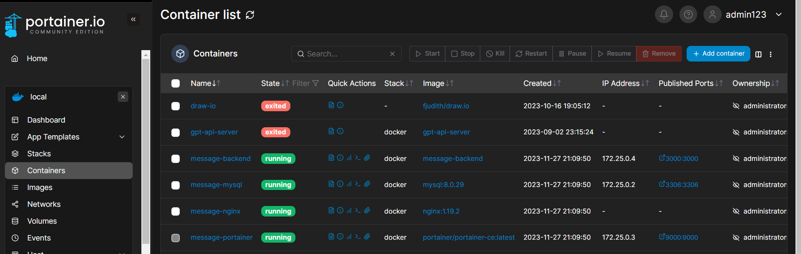
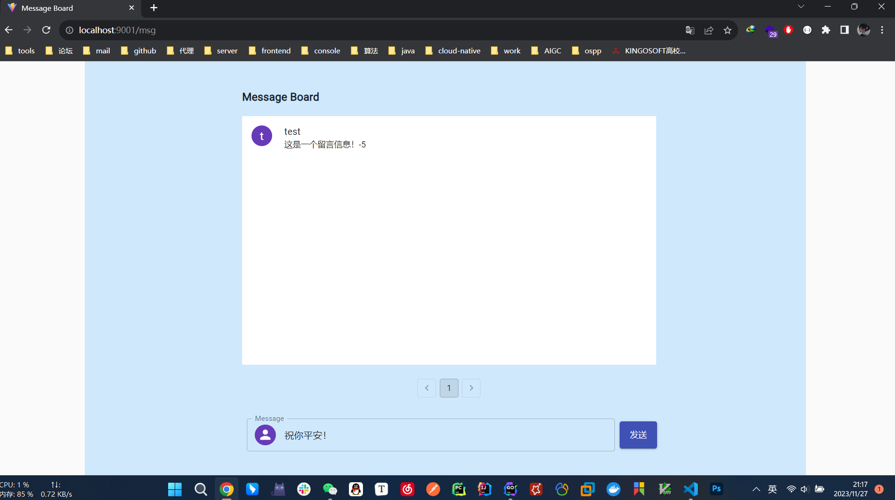
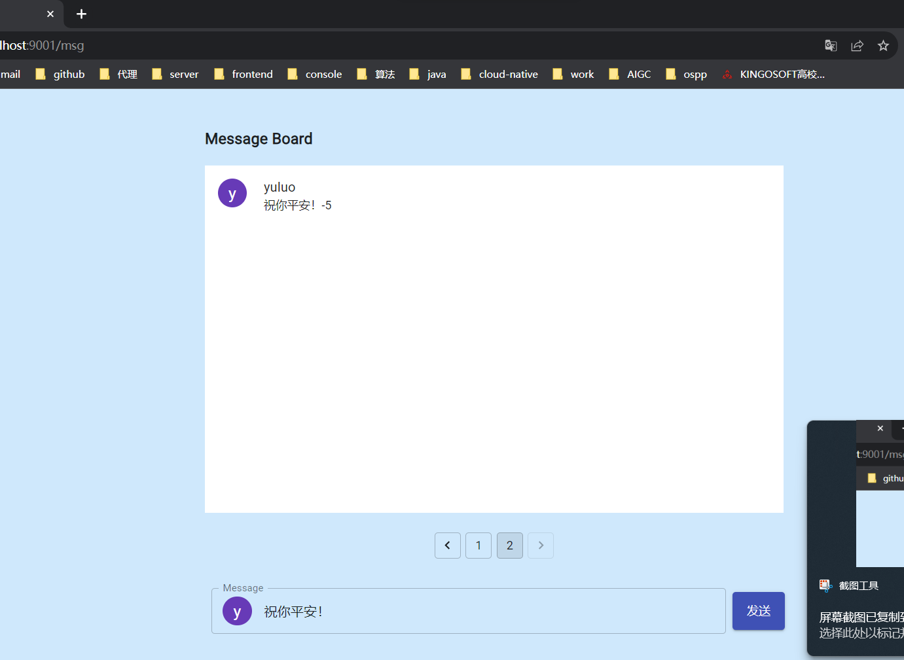
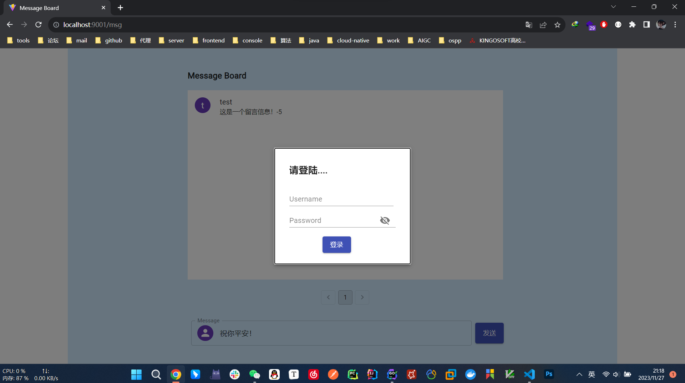
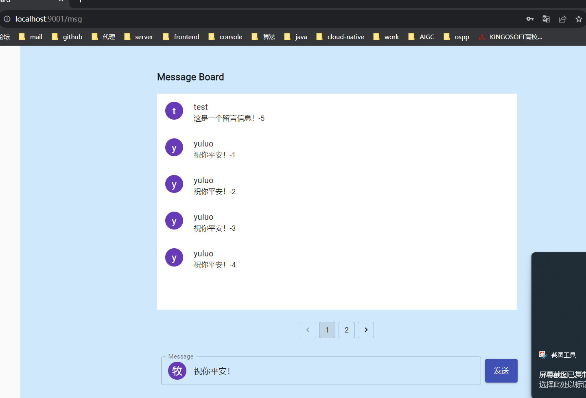
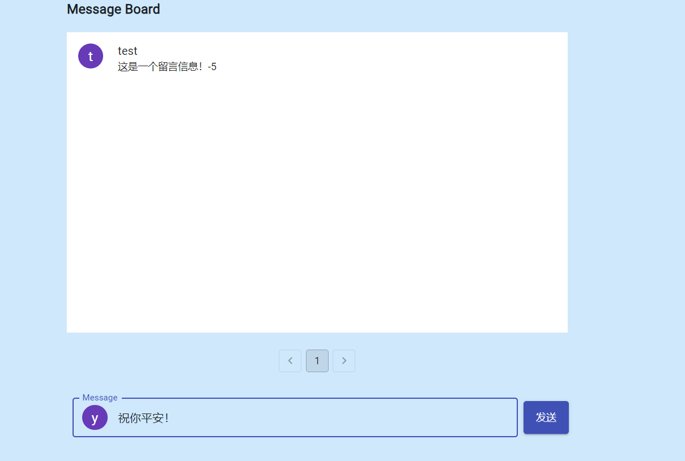
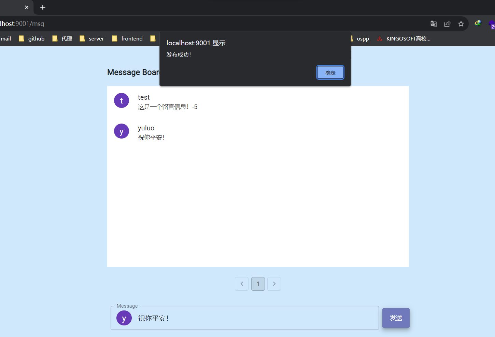
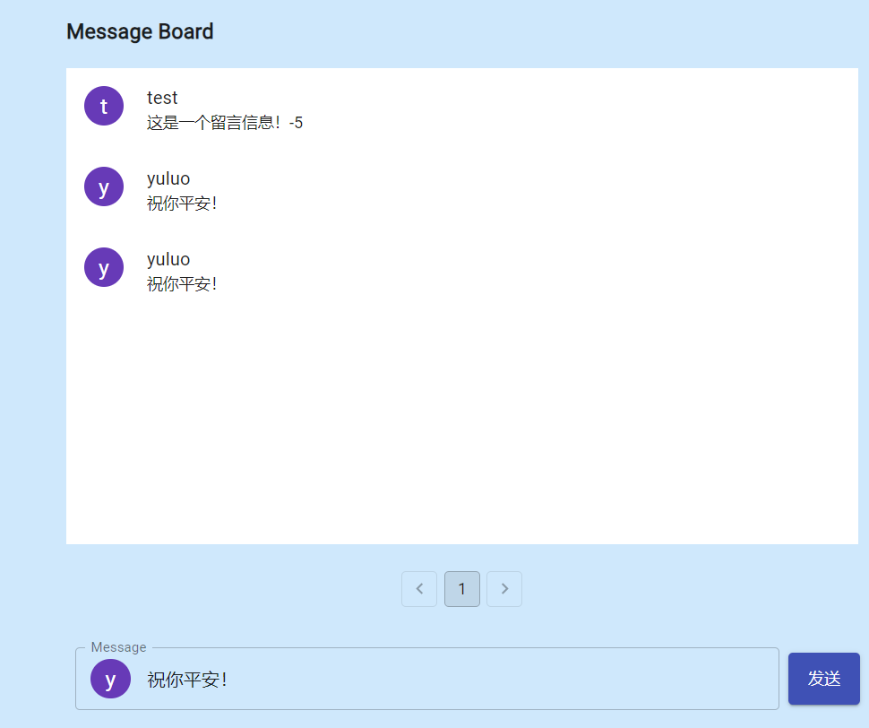

# gin + react practive 留言板项目

## 本地运行

> 开始之前需要配置数据库环境，sql 脚本参考

### 后端

1. cd backend
2. go mod tidy
3. cd cmd
4. go build .
5 ./cmd.exe (windows系统为例)

### 前端

1. cd frontend
2. yarn
3. yarn dev

## Doceker Compose 运行：

> 需要在 linux 系统下编译 go 项目为 linux 可执行文件，并移动到 docker/apps 目录下

1. cd docker
2. docker create network message
3. docker-compose up
4. 访问 http://localhost:9000/portainer 查看容器运行情况
5. 访问 http://localhost/dist/index.html 查看项目前端页面

### portainer 容器监控

## 运行结果示例

1. 用户未登录时，可查看所有留言信息

2. 翻页效果展示

3. 用户发表留言，在未登录时点击发表，弹出登陆模态框，提示登陆（登陆之后头像变为用户名第一个字母或汉字）

4. 发表留言之后，自动刷新当前页面。

